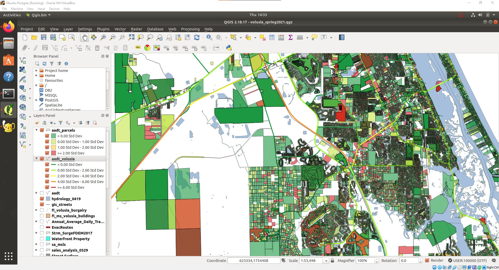

# cs540-volusia-parcel-aadt
**Author:** Quentin Goss<br>
**Email:** `gossq@my.erau.edu`<br>
**Class:** CS 540, Spring 2021<br>
**Professor:** Steven Lehr<br>
**Description:** *Volusia county parcel annual average daily traffic dataset for CS 540.*<br>

---



## Introduction
This github includes two parts:
1. Annual average daily traffic (AADT) dataset for parcels in Volusia County, Florida.
2. Source code used to generate the dataset.

## Dataset
The datset is compressed in `dataset.zip` in order to fit under the 100mb limit imposed by the university GitHub plan. To use this data, download the [dataset](https://github.com/gossq-erau/cs540-volusia-parcel-aadt/raw/main/dataset.zip) only.

### Shapefiles
Included are two shapefiles. These shapefiles may be imported into QGIS directly. 

---
`volusia-segment-aadt` ia AADT for the roadways of volusia county. This was retrieved from the Florida Department of Transportation (FDOT) and trimmed to include only Volusia County.<br>
`volusia-parcel-aadt` ia AADT for every parcel in the Volusia county dataset. This is processed data and the contribution of this project.

----

These are also shown in the example image using a color ramp from green (low AADT) to red (high AADT).


### CSV
In addition to the shapefiles is a `.csv` file of the processed information.<br>
`pid` is the parcel id.
`aadt` is the estimated AADT score for that parcel.<br>
`rank_` is a simple AADT score that is one of the following `low=1 mid=2 high=3`.

Running the included script `example.py` produces the first 15 values:
```
python example.py
             pid  rank_   aadt
0   572400000220      2  22500
1   572400000150      3  28000
2   572400000180      1    600
3   572400000030      1    950
4   572400000040      1   3000
5   581900020030      1    800
6   581900050020      1    950
7   581900050011      1   2500
8   581900070320      1   2500
9   581900070240      1    950
10  581900070220      3  36500
11  581900070200      1   4600
12  581900070360      1   1200
13  581900070380      1   1350
14  581900070530      1   2500
```


## Source Code
Provided in this repository is the source code used to generate the dataset. A combination of Windows 10, Ubuntu, Postgresql, and Python were used. It is outside of the scope of this project to automate this process however, the following is a summary of the process.

### Step 1. Preparing the AADT road segment data.
An AADT shapefile is retrieved from the FDOT website containing AADT data for all road segments in Florida. First, the geometry is converted to the State Plane Florida East coordinate reference system (CRS) using `ogr2ogr` and the following EPSG:
```
Volusia EPSG  2236
FDOT    EPSG 26917
```
Next, a python script trims the shapefile such that only segments within Volusia county are present and uploaded in the table `volusia.aadt_segments`.


### Step 2. Correlating parcels with AADT segment data.
There are some challenges for correlating parcels to the AADT segment data:
1. The AADT segment dataset is functional, in that it is human-reable, i.e. the AADT is measured in "sensible" segments e.x. between bridges and landmarks. As such, parcels cannot be correlated the AADT segments by road name or edge id.
2. AADT data is present for major highways, and lesser highways such as residential streets have no data.

To overcome these issues, we make a *best guess* to the AADT segment belongs to based on distance of the parcel marker from the `volusia.gis_address` table the nearest segment in the AADT dataset using the point-line distance 2d algorithm.


An exhaustive distance *d* of every Volusia county parcel marker was calculated for every AADT segment using Python. This process took 4 hours using 6 threads to complete. In the end, every parcel has a predicted "nearest" AADT segment in a table with parcel id `pid` and segment id `seg_id` in a table called `volusia.addr_addt`.


### Step 3. Generating the Shapefiles and CSV of the Dataset.
With the data uploaded to Postgres, the AADT parcel data is visualized in QGIS by combining parcel geometry and the AADT score from the linked segment. 
Shapefiles for the AADT parcel and segments are exported using QGIS.
The `csv` file was exported from PGAdmin4 featuring the same data as the AADT parcel shapefile minus the geometry field to reduce the size (*which reduced size from 220mb to 5.5mb*).
```
select 
	volusia.gis_parcels.pid,volusia.gis_parcels.geom,rank_,aadt
from 
	volusia.gis_parcels
join
	(
		select * from volusia.addr_aadt
		join volusia.aadt_segments 
		on volusia.addr_aadt.seg_id = volusia.aadt_segments.seg_id
	) as segs
on
	volusia.gis_parcels.pid = segs.pid;
```
